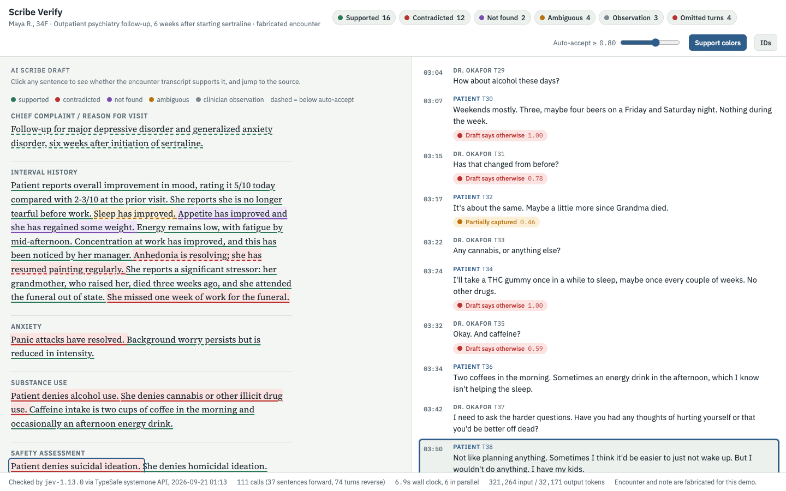
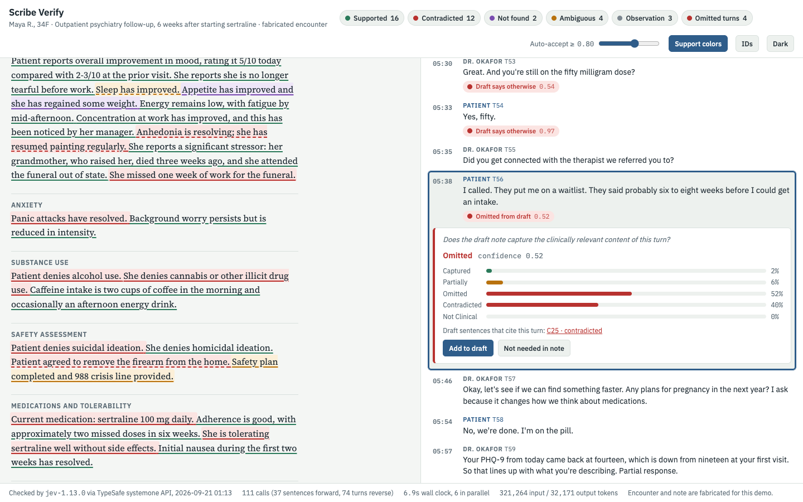

# Scribe Verify

**Can a small, non-generative model double-check an ambient AI scribe's note against the encounter transcript, sentence by sentence?**

This is a working mock-up of that idea, built on [Jev](https://docs.typesafe.ai) from TypeSafe AI. It takes an AI-drafted
psychiatry progress note and the transcript it was drafted from, asks Jev one question per sentence,
*"Is this statement supported by the encounter transcript?"*, and colours the draft by the answer:
**supported · contradicted · not found · ambiguous**. Click a sentence and it jumps to the transcript turn that
supports (or contradicts) it. The transcript is also checked in the other direction, so things the patient said
that never made it into the note are flagged as omissions.

**Live demo:** https://stephonomon.github.io/scribe-verify/  (self-contained page, results are embedded, no API calls from the browser)

**Video walkthrough:** https://youtu.be/d_vqWMtRmOI

[](https://youtu.be/d_vqWMtRmOI)

▶ [Watch Stephon walk through the demo on YouTube](https://youtu.be/d_vqWMtRmOI)

> Everything here is fabricated. There is no real patient, clinician, or recording. The encounter, the note,
> and the seeded errors were written for this demo. Nothing in this repository is medical advice or a validated
> clinical tool.

---

## Why

Ambient scribes (Abridge, Nuance DAX, Epic's own tools, and others) draft the note from the recording. The good
ones already let the clinician click a sentence and see the evidence in the transcript. Two failure modes still
land on the clinician at sign-off:

1. **Hallucination and drift.** The draft states something the patient never said, or states the opposite
   ("denies alcohol use" when the patient described three or four beers a night on weekends), or overstates
   ("sleep has improved" when the patient still wakes at 4 a.m. most nights).
2. **Omission.** Something clinically important was said and the draft simply doesn't have it. A handgun in the
   nightstand. A trazodone prescription from another doctor. A therapy waitlist.

The usual fix is to ask a second large language model to review the note. That works, but it is slow, expensive
at scale, and its "confidence" is whatever the model felt like writing. Jev is a different shape of model:
it does **no text generation**. You hand it a document (the *state*) and a set of typed questions (*Choice*,
*Noul*, *Score*), and it returns a calibrated probability distribution over the options for each one. That
makes it a natural fit for a verification layer:

- The question is fixed and auditable ("Is this statement supported by the transcript?"), not a free-form review.
- The output is a probability you can threshold. Below the threshold, route to human review; above it, auto-accept.
- Many questions can be asked of one document in a single call, which is exactly the shape of "check every
  sentence of this note against this transcript".

TypeSafe's own [citation check cookbook](https://docs.typesafe.ai/cookbooks/citation_check) does this for
LLM-generated citations against a source document (verified / contradicted / unsupported / fabricated, with an
auto-accept threshold). This repo is that recipe pointed at a clinical note.

## What it does

Two passes, both against the raw transcript, both using only Jev `choice` questions.

| Pass | Unit | Question asked of Jev | Options |
|---|---|---|---|
| Forward | each draft sentence | Is this statement supported by the encounter transcript? | `supported` · `contradicted` · `not_found` · `ambiguous` |
| Forward | each draft sentence | Which single transcript turn is the primary evidence for or against it? | `T01` … `T74` · `none` |
| Reverse | each transcript turn, with the preceding turn as context | Does the draft note capture the clinically relevant content of this turn? | `captured` · `partially` · `omitted` · `contradicted` · `not_clinical` |

The forward pass colours the draft and gives click-to-source. The reverse pass finds omissions. Confidence is
Jev's own calibrated probability for the chosen option; sentences below the auto-accept slider get a dashed
underline for human review, mirroring the cookbook's `AUTO_ACCEPT` threshold.



### The viewer

- **Left:** the AI draft, one span per sentence. Colour encodes the verdict; the underline style encodes whether it cleared the threshold.
- **Right:** the transcript with timestamps and speaker. Turns the draft missed or contradicted carry a flag; flags below 0.5 confidence are faded.
- Click a sentence to open its verification card (verdict, Jev's probability over the four options, the source turn quoted, other candidate turns) and scroll the transcript to the source. Click blank space in the draft to close it.
- Click a transcript flag to see the capture verdict and which draft sentences cite that turn.
- The header chips filter the draft by verdict. The **auto-accept** slider sets the confidence threshold. **Support colors** turns the colouring off for a before/after. **IDs** shows sentence IDs. **Dark / Light** switches theme and remembers your choice in the browser.
- "Add to draft" and "Not needed in note" on the transcript cards are placeholders that show where this would plug into a real scribe's sign-off flow. Nothing is edited.

## Results

Run on 2026-09-21 with `jev-1.13.0`. The draft has 37 sentences; each one carries a hidden ground-truth label
(`ok`, `contradicted`, `hallucinated`, `ambiguous`, or `observation`) in [`data.py`](data.py) that the model never sees.

| | |
|---|---|
| Forward verdicts matching the seeded label | **33 / 37** |
| Seeded hallucinations (improved appetite; bipolar family history) | both `not_found` at 1.00, source `none` |
| Seeded contradictions (denies alcohol, denies SI, sertraline 100 mg, weekly CBT, discontinue trazodone, six-week follow-up, one week off work, resumed painting, no side effects, denies cannabis) | all caught, 0.71 to 1.00 |
| The four misses | all defensible readings at lower confidence (below) |
| Omissions surfaced by the reverse pass | early-waking frequency, trazodone grogginess, therapy waitlist, and more |
| Whole run | 111 API calls, 6 in parallel, 6.9 s wall clock, 321k input tokens |

The four "misses" are the interesting ones, because in each case the ground-truth label was a judgement call:

| Sentence | Seeded | Jev said | Why Jev has a point |
|---|---|---|---|
| Panic attacks have resolved. | ambiguous | contradicted 0.82 | Patient had one mild attack last month. "Resolved" is false. |
| Patient agreed to remove the firearm from the home. | ambiguous | contradicted 0.77 | She agreed to *ask about a safe* and explicitly would not promise removal. |
| Safety plan completed and 988 crisis line provided. | ok | ambiguous 0.89 | The transcript only agrees to do it before she leaves; it isn't shown happening. |
| Add bupropion for sexual side effects. | contradicted | ambiguous 0.74 | The clinician raised bupropion but deferred it four weeks. |

Mental status exam sentences ("well groomed, cooperative") come back `not_found`. That is correct: they are the
clinician's observations, not something anyone said, and the viewer treats them as a separate category
rather than as errors.

### One call, many questions (fan-out)

The 111-call run treats each sentence as its own request. Jev's API also accepts many questions over one
`state` in a single call, and answers them independently: each question gets its own probability distribution,
and none of them can see the others. [`fanout_probe.py`](fanout_probe.py) tests that on this note.

**Run A: the 37 support questions in one call.**

| | 37 separate calls | 1 call × 37 questions |
|---|---|---|
| Latency | 15.1 s summed (6.9 s wall, 6-wide) | **0.5 s** |
| Input tokens | 222,722 | **13,044** |
| Verdicts | — | identical, 37 / 37 |

**Run B: the real-life shape, support *and* source-turn for every sentence.** The source question is a 75-way
choice (one option per turn plus `none`), which costs about 2.9k tokens per question, so 37 of them exceed Jev's
64k-token request cap. Chunked into three calls run in parallel (support; source for the first half; source for
the second half):

| | 37 separate calls | 3 parallel calls, 74 questions |
|---|---|---|
| Wall-clock | 6.9 s | **0.84 s** |
| Input tokens | 222,722 | **111,263** (13k + 48k + 50k) |
| Output tokens | 4,800 | 27,503 (free) |
| Verdicts | — | identical, 37 / 37 |
| Source turns | — | 34 / 37 agree; the three differences pick the clinician's statement over the patient's acknowledgement of it, or vice versa |

So a short transcript supports dozens of independent yes/no questions, and they ride on one copy of the
transcript. The obvious next optimisation is to shrink the source question (retrieve a handful of candidate turns
first, then ask Jev to pick), which would bring Run B down to a single call.

### Estimated cost as each would actually be used

*Estimates, not a benchmark.* The Jev column is measured (Run B above). The Haiku column is how a scribe vendor
would plausibly wire a frontier-lab model: one request per sentence, the transcript in the system prompt, structured
output for verdict, source turn and confidence. Its input tokens are measured with Anthropic's token-counting
endpoint on the real prompts; its output tokens (~45 per sentence) and latency are estimates. Prices: Claude Haiku 4.5
at $1 / $5 per million input / output tokens, cache writes at 1.25× and cache reads at 0.1×; Jev at $0.042 per
million input tokens with output free, from TypeSafe's docs as of 2026-09-20. Check both before quoting.

| Per encounter (37 sentences) | Haiku 4.5, 37 calls, no cache | Haiku 4.5, 37 calls, transcript cached | Jev, 3 parallel calls |
|---|---|---|---|
| Input tokens | 100,643 | 8,809 fresh + 2,482 cache write + 89,352 cache read | 111,263 |
| Output tokens | ~1,700 | ~1,700 | 27,503 (free) |
| Cost | ~$0.109 | ~$0.029 | ~$0.0047 |
| Wall-clock | ~7–12 s at 6 in parallel | same | 0.84 s |
| Cost ratio vs Jev | ~23× | ~6× | 1× |

| Encounters | Haiku, cached | Haiku, uncached | Jev |
|---|---|---|---|
| 1,000 | $29 | $109 | $4.70 |
| 100,000 | $2,900 | $10,900 | $470 |
| 1,000,000 | $29,000 | $109,000 | $4,700 |

Two honest readings. First, both are cheap in absolute terms: a cached Haiku verification layer costs about three
cents per note. Second, the Jev advantage at this shape is roughly 6× on cost and 10× on latency, not the 50× the
support-only probe suggested, because the 75-way source question is expensive. This table says nothing about
accuracy or calibration, which only the benchmark below would settle. This encounter is short (about seven minutes,
37 sentences); a 15–20 minute visit with 80 sentences would roughly double or triple every row, and the ratios should hold.

## Limitations, honestly

- **It is one fabricated encounter.** The errors were seeded by the same author who wrote the transcript. Real scribe errors are subtler and real transcripts are messier (crosstalk, ASR errors, three people in the room).
- **Clinician-question noise.** In the reverse pass, a clinician's question ("Has that changed from before?") sometimes gets flagged "draft says otherwise" because the draft denies the thing the question presupposes. Arguably right, but noisy. Flags below 0.5 are rendered faded.
- **Sentence segmentation is given, not derived.** A real system has to split the note into checkable claims; compound sentences hide multiple claims.
- **Not_found is not the same as wrong.** Prior history, chart data, and the clinician's exam all legitimately land in a note without being spoken. A production version needs provenance categories beyond "the transcript".
- **No clinical validation of any kind.** This is a mock-up to make the architecture concrete.
- **Business-associate status.** Transcripts are PHI. Whether a given vendor can receive them is a contracting question this repo doesn't answer.

## What I'd benchmark next

A 2 × 2: Jev and a Claude model, each run both as one batched request and as one request per sentence. The Jev row is
done (verdicts identical either way). The Claude row is the open question, and the comparison should report cost
both uncached and with prompt caching. Measure:

- latency and cost per encounter
- extraction accuracy against the seeded labels
- stability when fields are added or removed from the schema (does changing one question perturb the others?)
- confidence calibration (does 0.8 mean 80%?)

The seeded ground truth in `data.py` is already set up for it.

## Run it yourself

Python 3.10+, standard library only. You need a TypeSafe API key from https://console.typesafe.ai.

```bash
export TYPESAFE_API_KEY=...          # or put it in ~/.typesafe_api_key
python verify.py                     # both passes → results.json (about 7 s)
python build.py                      # embeds results.json into template.html → index.html
python fanout_probe.py               # the single-call comparison
open index.html
```

| File | What it is |
|---|---|
| [`data.py`](data.py) | The 74-turn transcript, the 37-sentence draft with hidden ground-truth labels, and the omission ground truth |
| [`verify.py`](verify.py) | The two Jev passes. The question definitions are at the top and are the whole "prompt" |
| [`fanout_probe.py`](fanout_probe.py) | Every forward question over one copy of the transcript (Runs A and B), compared against `results.json`; writes `fanout_result.json` |
| [`template.html`](template.html) | The viewer (no framework, no build step, works offline) |
| [`build.py`](build.py) | Embeds `results.json` into the template and strips the ground-truth labels |
| [`index.html`](index.html) | The built page that GitHub Pages serves |
| [`results.json`](results.json) | The run reported above, so you can inspect every probability without an API key |

The Jev request shape, for reference (see the [docs](https://docs.typesafe.ai) for the full API):

```json
POST https://api.typesafe.ai/v1/systemone
{
  "model": "jev-1.13.0",
  "state": { "transcript": "[T01 00:00 Clinician] Hi Maya ...", "claim": "Patient denies alcohol use." },
  "questions": {
    "relation": {
      "type": "choice",
      "instructions": "Is the `claim` supported by the encounter `transcript`?",
      "criteria": {
        "supported":    { "what": "The transcript states the claim or directly implies it is true" },
        "contradicted": { "what": "The transcript states the opposite of the claim ..." },
        "not_found":    { "what": "Nothing in the transcript addresses what the claim asserts" },
        "ambiguous":    { "what": "The transcript addresses the claim but the evidence is mixed or partial" }
      }
    }
  }
}
```

Response: `answers.relation.choice` plus `answers.relation.probabilities` over the four options.

## Links

- Jev / TypeSafe AI docs: https://docs.typesafe.ai
- The cookbook this is modelled on: https://docs.typesafe.ai/cookbooks/citation_check
- TypeSafe console (API keys): https://console.typesafe.ai

## Credits and disclosures

Concept and direction: [Stephon Proctor](https://github.com/Stephonomon), PhD, MBI, ABPP, ACHIP.

The code, the fabricated encounter and draft note, the seeded errors, the viewer, and the first draft of this README
were written by Claude (Claude Code, model Fable 5.1) working from that direction; the author set the direction and ran the results.
The Jev results reported above are real API responses, not simulated.

No affiliation with TypeSafe AI, Abridge, Epic, Nuance, or any scribe vendor. No funding. The author's employer
had no role in this.

MIT licensed. See [LICENSE](LICENSE).
